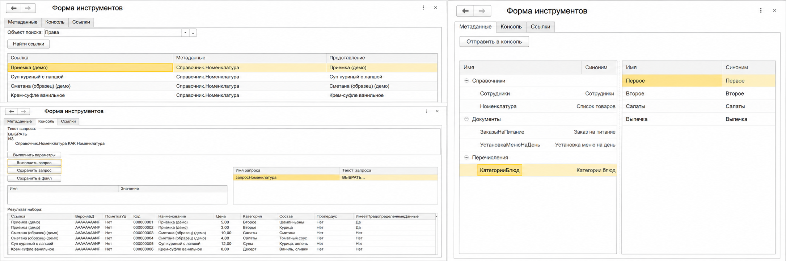

# Инструменты Разработчика DevKit (Расширение 1С:Предприятие 8.3)

## Описание проекта

Данный проект представляет собой специализированное расширение конфигурации (DevKit) для платформы 1С:Предприятие 8.3. Оно предназначено для предоставления разработчикам и системным администраторам набора дополнительных инструментов отладки, профилирования, анализа данных и управления системой.

Использование архитектуры расширений (.cfe) позволяет внедрять инструменты без изменения метаданных основной конфигурации и снятия ее с поддержки.

## Основные возможности

* Быстрый доступ к служебным обработкам и технической информации базы данных.
* Изолированная работа функционала в рамках собственной подсистемы.
* Безопасное управление доступом: инструменты скрыты от рядовых пользователей и доступны только техническим специалистам через выделенную роль.
* Поддержка интеграции с типовыми и нетиповыми конфигурациями.

---

## Описание функционала

Интерфейс инструментов разделен на логические вкладки для удобной работы с различными объектами базы данных.

### Вкладка «Метаданные»

* **Отправить в консоль:** Передает выбранный в дереве объект метаданных или конкретное значение (например, элемент справочника или значение перечисления) на вкладку «Консоль». Это позволяет быстро использовать выбранный объект в качестве параметра или шаблона для написания запроса к базе данных.

### Вкладка «Консоль»

* **Заполнить параметры:** Анализирует введенный текст запроса на наличие переменных (параметров, обычно начинающихся с символа `&`) и автоматически выводит их в таблицу ниже для того, чтобы пользователь мог задать им конкретные значения перед выполнением.
* **Выполнить запрос:** Инициирует обращение к базе данных по написанному тексту запроса и выводит полученную выборку данных в нижнюю таблицу результатов.
* **Сохранить запрос:** Записывает текущий текст запроса и его имя в список сохраненных запросов (таблица справа) для возможности его быстрого повторного использования в будущем.
* **Сохранить в файл:** Позволяет экспортировать текст текущего запроса во внешний файл на диск для передачи другим разработчикам или сохранения резервной копии.

### Вкладка «Ссылки»

* **Найти ссылки:** Запускает глобальный поиск по информационной базе. Система находит и выводит в таблицу все объекты (элементы справочников, документы, записи регистров), в которых используется (указана ссылка на) выбранный в поле «Объект поиска» элемент.

---

## Требования к системе

* **Платформа:** 1С:Предприятие 8.3 (протестировано на версии 8.3.22).
* **Тип приложения:** Тонкий клиент / Веб-клиент / Толстый клиент.

---

## Установка и развертывание

1. Скачайте файл расширения (`ИнструментыРазработчикаDevKit_1.cfe`) из данного репозитория.
2. Запустите информационную базу в режиме **Конфигуратор**.
3. Перейдите в меню `Конфигурация` -> `Расширения конфигураций`.
4. Нажмите кнопку `Добавить` (создайте новое расширение с параметрами по умолчанию).
5. Выберите созданное расширение, перейдите в меню `Действия` -> `Загрузить конфигурацию из файла...` и выберите скачанный файл `.cfe`.
6. Снимите флажки «Безопасный режим» и «Защита от опасных действий», так как инструменты разработчика требуют расширенных прав для работы с базой данных.
7. Сохраните и обновите конфигурацию базы данных (F7).

---

## Настройка прав доступа

Во избежание компрометации данных, доступ к инструментам расширения жестко ограничен.

Для того чтобы функционал появился в интерфейсе пользователя, необходимо назначить ему соответствующую роль:

1. Откройте профиль нужного пользователя (администратора или разработчика).
2. Назначьте ему роль `Расш1_ОсновнаяРоль`.
3. Убедитесь, что у рядовых пользователей системы данная роль не выбрана.
